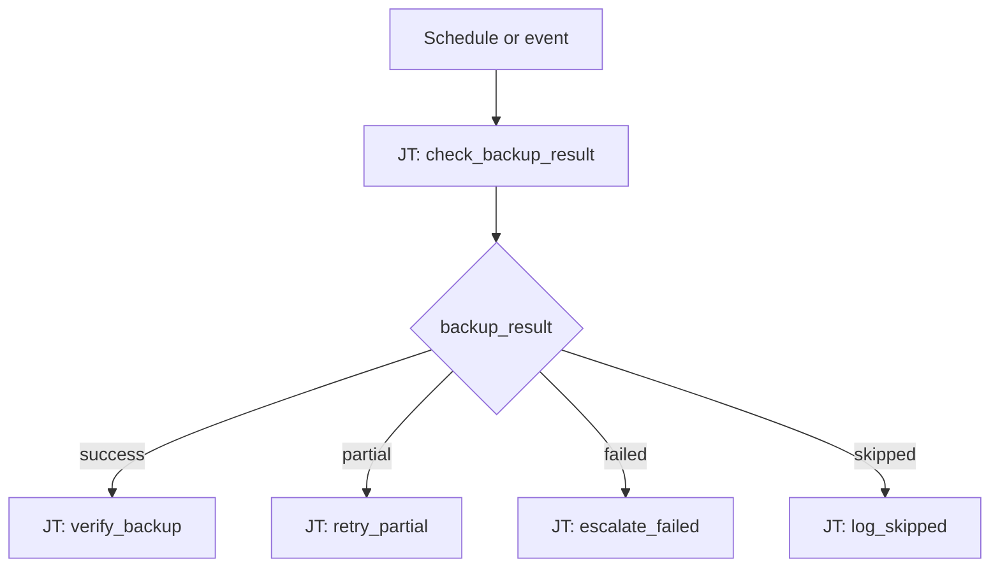

# Backup Management 101: Backup Result Routing

**Status: Coming soon** — scaffold only.

## What this demo shows

Backup jobs often return outcomes that binary workflows mishandle. Switch on `backup_result`:

| `backup_result` | Action |
|---|---|
| `success` | Verify restore point, log OK |
| `partial` | Retry failed targets, notify ops |
| `failed` | Escalate, open incident |
| `skipped` | Log reason, check schedule |

## Workflow



## Playbooks

🚧 **Under development** — playbook list and source links will be added when this demo is built.

## Planned artifacts

```
101-backup-result-routing/
  ao/
  aap/playbooks/
  README.md
```
