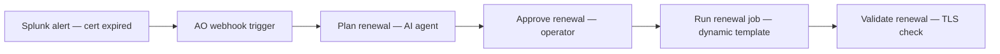

# Intelligent Cert Lifecycle (101)

AI-driven certificate renewal — an automation orchestrator workflow where an AI agent picks the correct AAP job template, an operator approves, and Ansible renews and validates TLS.

## What this demo shows

Two certificates expire on production services at the same time. Splunk fires alerts to automation orchestrator. An AI agent analyzes each certificate, discovers available AAP job templates, and selects the correct renewal strategy — PEM for nginx, Java keystore for the API server — without hardcoded routing.

## Workflow

## Docs

| Document | Purpose |
|---|---|
| [SETUP_GUIDE.md](SETUP_GUIDE.md) | Step-by-step environment setup |
| [REQUIREMENTS.md](REQUIREMENTS.md) | Prerequisites and infrastructure |
| [DEMO_SCRIPT.md](DEMO_SCRIPT.md) | Live demo narration script |

## Import workflow

- Manual trigger: [`ao/cert-demo-101-manual.json`](ao/cert-demo-101-manual.json)
- Webhook trigger: [`ao/cert-demo-101-webhook.json`](ao/cert-demo-101-webhook.json)

## Playbooks

| Playbook | What it does | Runs on |
|---|---|---|
| [`renew_certificate.yml`](https://github.com/ansible-tmm/aap-orchestrator-demos/blob/main/cert-rotation/101-cert-lifecycle/aap/playbooks/renew_certificate.yml) | Pulls a new PEM certificate from Vault CA, installs it for nginx, and reloads the service. | RHEL node (nginx / PEM) |
| [`renew_keystore_certificate.yml`](https://github.com/ansible-tmm/aap-orchestrator-demos/blob/main/cert-rotation/101-cert-lifecycle/aap/playbooks/renew_keystore_certificate.yml) | Renews a Java keystore certificate for the API server, updating the keystore and restarting the application. | RHEL node (Java keystore) |
| [`validate_certificate.yml`](https://github.com/ansible-tmm/aap-orchestrator-demos/blob/main/cert-rotation/101-cert-lifecycle/aap/playbooks/validate_certificate.yml) | Runs an OpenSSL TLS handshake check and reports certificate subject, issuer, and expiry after renewal. | RHEL node |
| [`notify_mattermost.yml`](https://github.com/ansible-tmm/aap-orchestrator-demos/blob/main/cert-rotation/101-cert-lifecycle/aap/playbooks/notify_mattermost.yml) | Posts renewal status, agent confidence, and analysis summary to Mattermost after the workflow completes. | localhost (Mattermost API) |
