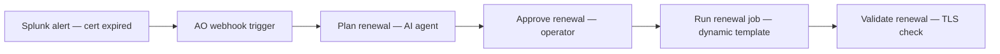

# Certificate Rotation 101: Single Cert Renewal

## What This Demo Shows

A monitoring alert fires for an expired nginx TLS certificate. Automation orchestrator receives the alert, an AI agent plans the renewal (selects the correct job template and variables), an operator approves, AAP renews the certificate from a Vault CA, and the workflow validates the new cert is healthy.

## Workflow



## Prerequisites

| Component | Required | Details |
|-----------|----------|---------|
| AAP Controller | Yes | 2.5+ with automation orchestrator |
| automation orchestrator | Yes | Connected to AAP over SSL |
| VM | Yes | 1x RHEL 9, SSH accessible from AAP |
| HashiCorp Vault | Yes | Runs as container on the VM (provisioned by setup playbook) |
| OpenShift | No | Not needed for this level |
| Monitoring | No | Manual trigger via curl |
| LiteLLM / LLM | Yes | Required for the AI agent node in AO |

## Collections Required

- community.crypto >= 2.0
- containers.podman >= 1.10
- ansible.posix >= 1.5

## Estimated Setup Time

~15 minutes

## Quick Start

```bash
# 1. Install collections
ansible-galaxy collection install -r ../../shared/collections/requirements.yml

# 2. Provision the VM with nginx + Vault
ansible-playbook -i inventory/hosts.yml setup/provision_vm.yml

# 3. Generate an expired certificate
ansible-playbook -i inventory/hosts.yml setup/generate_expired_cert.yml

# 4. Verify the cert is expired
curl -vk https://100.48.81.58

# 5. Register job templates in AAP
ansible-playbook -i inventory/hosts.yml setup/setup_aap.yml

# 6. Import ao/cert-reactive.json into automation orchestrator

# 7. Trigger the alert
./test/trigger_alert.sh <AO_HOST> <WEBHOOK_TOKEN>

# 8. Approve the renewal in the AO UI

# 9. Verify the cert is now valid
curl -vk https://100.48.81.58
```

## What Happens During the Demo

1. Webhook alert arrives at AO (simulating Splunk, Prometheus, or Dynatrace)
2. Normalize Alert script extracts hostname, service, cert CN from the payload
3. AI agent analyzes the alert and selects "Renew Certificate" job template with correct variables
4. Condition node verifies the agent produced a valid plan
5. Operator approves the renewal in the AO UI
6. AAP runs the renewal playbook: pulls CA from Vault, generates new key + CSR, signs with valid dates, deploys to nginx, reloads
7. AAP runs the validation playbook: TLS handshake, checks days remaining > 0, confirms HTTP 200
8. Summary script displays the result

## AO vs AAP Comparison

| Step | AO Workflow | AAP Workflow |
|------|------------|-------------|
| Template selection | AI agent picks dynamically based on alert context | Hardcoded in workflow node |
| Approval context | Agent reasoning and blast radius shown to approver | Basic approve/deny |
| Event ingestion | Native webhook trigger | Requires EDA rulebook |
| Execution visibility | Visual flow with per-node status | Job list view |
