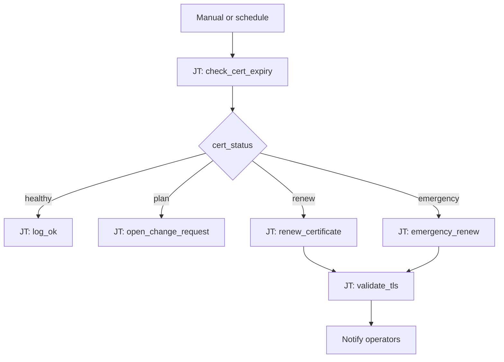

# Certificate Rotation 102: Expiry Threshold Routing

**Status: Coming soon** — scaffold only. Playbooks and AO workflow JSON not built yet.

## What this demo shows

Rule-based certificate expiry handling — distinct from [101 Intelligent Cert Lifecycle](../101-cert-lifecycle/) which uses an AI agent to pick renewal templates. This demo switches on `cert_status` from days remaining — no LLM required.

| `cert_status` | Days remaining | Action |
|---|---|---|
| `healthy` | > 60 | Skip — no action |
| `plan` | 30–60 | Open change request |
| `renew` | 7–30 | Run renewal playbook |
| `emergency` | < 7 | Renew + alert + verify chain |

**One-liner:** *Expiry isn't pass/fail — it's a countdown.*

## Workflow



## Relationship to other cert demos

| Demo | Approach |
|---|---|
| [101 Intelligent Cert Lifecycle](../101-cert-lifecycle/) | AI agent selects PEM vs keystore renewal (active) |
| **102 Expiry Threshold Routing** (this) | Rule-based switch on days remaining |
| [201 Risk-Based Routing](../201-risk-based-routing/) | AI-assessed risk tier |
| [301 Proactive Assessment](../301-proactive-assessment/) | Scheduled estate-wide scan |

## Planned artifacts

```
102-cert-expiry-switch/
  ao/
  aap/playbooks/
  README.md
```
