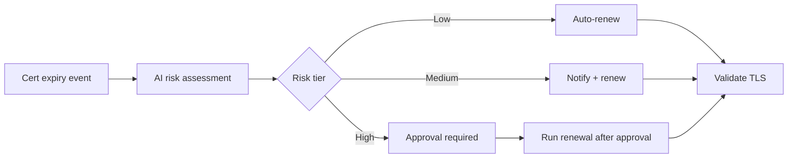

# Certificate Rotation 201: Risk-Based Routing

Coming soon. This demo extends 101 with:

- Risk scoring per certificate (low/medium/high)
- Switch-node routing to different approval flows per risk level
- Blast radius analysis
- Multiple hosts with different cert types

## Workflow

## Playbooks

🚧 **Under development** — playbook list and source links will be added when this demo is built.
