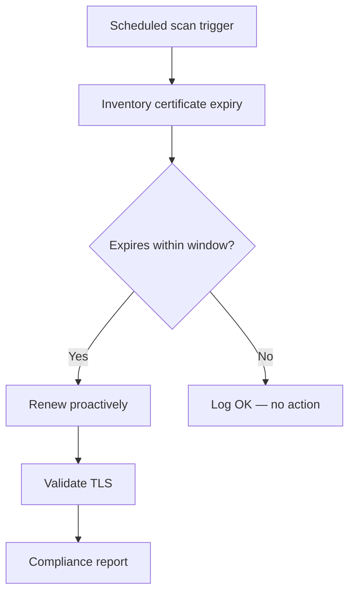

# Certificate Rotation 301: Proactive Assessment

Coming soon. This demo extends 201 with:

- Scheduled scanning of the full certificate estate
- AI classification across all discovered certs
- Auto-remediation for low-risk certs
- Escalation for critical certs
- Compliance reporting

## Workflow

## Playbooks

🚧 **Under development** — playbook list and source links will be added when this demo is built.
