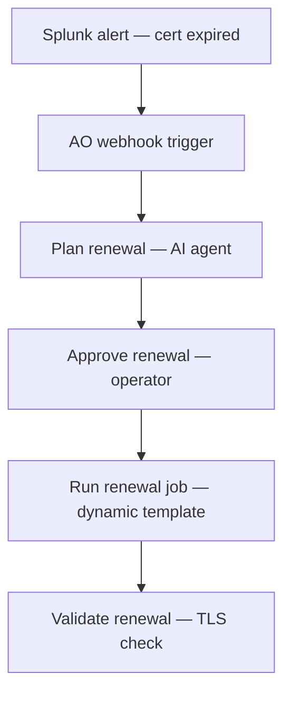

# Certificate Lifecycle Management Demos

AI-driven certificate lifecycle management using automation orchestrator. The AI agent discovers available job templates, analyzes the certificate type and history, selects the correct renewal strategy, and routes intelligently without hardcoded logic.

## Demos

| Level | Demo | What It Shows |
|---|---|---|
| [101](101-cert-lifecycle/) | Intelligent Cert Lifecycle | Two cert types (PEM + Java keystore), AI routing, Splunk integration, operator approval |
| [102](102-cert-expiry-switch/) | Expiry Threshold Routing | Coming soon — rule-based switch on days remaining |
| [201](201-risk-based-routing/) | Risk-Based Routing | Coming soon |
| [301](301-proactive-assessment/) | Proactive Assessment | Coming soon |

## The Story

A Splunk alert fires when a TLS certificate expires. Automation orchestrator receives it, an AI agent analyzes the certificate details and queries AAP to select the correct renewal template, an operator approves, and AAP renews and validates automatically.

What makes it intelligent: the same workflow handles a PEM certificate on nginx and a Java keystore on an API server. The agent figures out which is which and selects the right template. No conditions. No hardcoded routing.

## Workflow (101)

