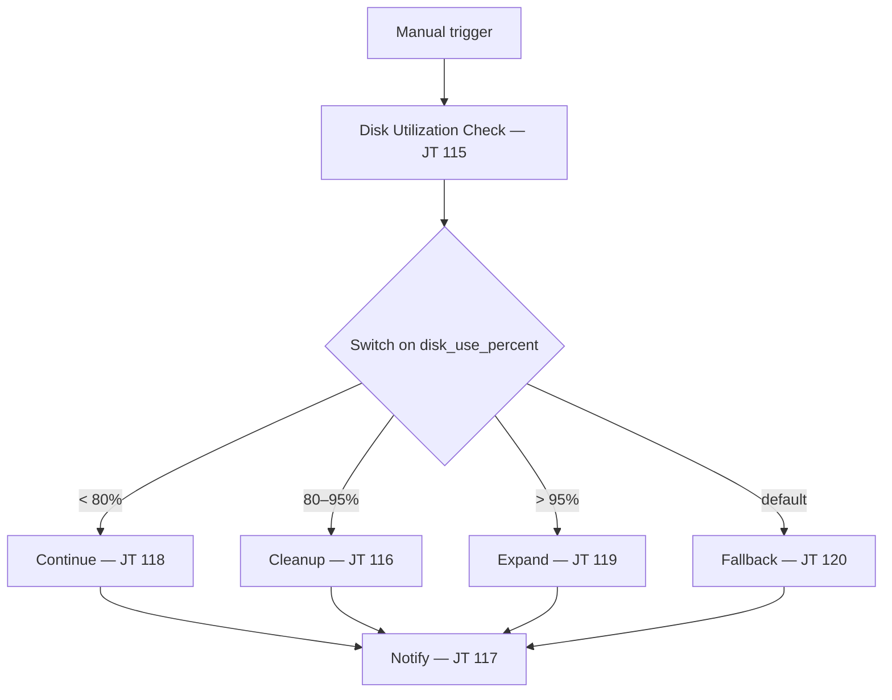

# Disk Demo 101: Disk Utilization & Remediation Workflow

Monitor filesystem usage on a Linux host and respond proportionally — from "all good" through automated cleanup to EBS volume expansion — then tell the team in Mattermost what happened.

## How the use case works

Every ops team deals with disk pressure. The wrong automation treats it as binary: either ignore it or panic. This workflow encodes how you'd actually triage it:

| Situation | What happens |
|---|---|
| Disk is healthy (`< 80%`) | Log and notify — no changes to the host |
| Disk is elevated (`80–95%`) | Reclaim space: dnf package cache and old log archives, then report how much was freed |
| Disk is critical (`> 95%`) | Expand the root EBS volume in AWS, grow the partition and XFS filesystem on the host, report before/after volume size |
| Switch can't classify (default port) | No automated fix — notify as unsupported and flag for manual review |

The flow is always the same shape: **check → route → remediate → notify**. Ansible playbooks do the work on the host (and AWS for expand). Automation orchestrator wires the steps together and passes artifacts between them so each job knows what the previous one found.

## Why a switch — not success/failure branching

| Classic workflow branching | automation orchestrator switch |
|---|---|
| Success / failure / always | Route on a **value** (`disk_use_percent`) |
| Nested decision nodes | One switch, four ports |
| One recovery playbook with `when:` soup | Small single-purpose job templates |

The check playbook publishes `disk_use_percent` and `disk_tier` via `set_stats`. The switch reads `disk_use_percent` directly. Each remediate branch publishes a full notify artifact bundle; the notify job on that branch reads only from its upstream remediate step.

## Workflow



Import [`ao/disk-demo-101.json`](ao/disk-demo-101.json) — this is the **working nostromo export** with all four branches and per-branch notify nodes. Activity UUIDs and `credential_id` are environment-specific; update `job_template_id` values if your Controller IDs differ.

### Nostromo job template map

| JT ID | Name | Playbook |
|---|---|---|
| 115 | Disk Utilization Check | `check_disk.yml` |
| 116 | Linux - Remediate - Disk Cleanup | `remediate_disk_cleanup.yml` |
| 117 | Notify Chatroom | `notify_chatroom.yml` |
| 118 | Linux - Remediate - Continue | `remediate_disk_continue.yml` |
| 119 | Linux - Remediate - Disk Expand | `remediate_disk_expand.yml` |
| 120 | Disk Utilization - Fallback | `remediate_disk_fallback.yml` |

## Switch routing

| Switch port | Condition | Remediate | Notify title |
|---|---|---|---|
| `<80%` | `disk_use_percent < 80` | Continue — no action | Disk Utilization OK (green) |
| `80-95%` | `> 80 and < 95` | Cleanup dnf cache + old logs | Warning — Disk Cleanup (orange) |
| `>95%` | `disk_use_percent > 95` | Expand EBS + grow filesystem | Critical — Disk Expanded (purple) |
| `default` | no match (e.g. exactly 80 or 95) | Fallback — manual review | Unsupported Disk Tier (red) |

Thresholds are also defined in `group_vars/all.yml` (`disk_warn_threshold: 80`, `disk_critical_threshold: 95`). The AO switch uses `disk_use_percent` from check artifacts; keep switch bounds aligned with the playbook thresholds.

## What you need

- AAP 2.7+ with automation orchestrator
- One RHEL EC2 host AAP can SSH to
- AWS credentials on the execution environment for the expand path (EBS volume modification)
- Mattermost API token on the notify job template (`api_chat_token`)

`ec2_instance_id` in inventory is optional — the expand playbook auto-discovers the instance via EC2 metadata or AWS API IP lookup.

## Setup

**1. Register six job templates** from `aap/playbooks/` (see table above).

**2. Import** [`ao/disk-demo-101.json`](ao/disk-demo-101.json) into automation orchestrator.

**3. Adjust** `job_template_id` and `credential_id` on each node if your environment differs from nostromo.

**4. Launch** from the AO UI.

## Testing branches without filling the disk

`check_disk.yml` accepts `test_disk_use_percent` as an extra var. When set, it skips live `df` and simulates usage for routing.

On the **Check** node in AO, set `extra_vars`:

| Branch | `test_disk_use_percent` |
|---|---|
| Continue (`<80%`) | `75` |
| Cleanup (`80-95%`) | `85` |
| Expand (`>95%`) | `96` |
| Default / fallback | `80` or `95` (exact boundary — no case matches) |

Remove `test_disk_use_percent` (or leave empty) for a real disk check.

The exported workflow currently has `"test_disk_use_percent": 50` on the check node — safe default that routes to **Continue**. Change or remove it before a production run.

## Per-branch notify pattern

Each remediate branch has its **own** notify node (same JT 117). Every notify `extra_vars` key references **only** the upstream remediate activity on that branch — never a mix of cleanup + expand + continue in one block.

Example — warn path references cleanup only:

```json
"disk_use_percent": "${activity_5f6d0c2e_a677_4517_b013_ab2a9f8c2d59.artifacts.disk_use_percent}"
```

This avoids AO namespace errors when a converged notify node tries to read artifacts from branches that never ran.

### Artifact contract

Every remediate playbook publishes the same keys via `aap/playbooks/tasks/publish_notify_artifacts.yml`:

`notify_host`, `disk_mount`, `disk_use_percent`, `disk_tier`, `remediation_action`, `disk_use_percent_before/after`, `total_reclaimed_mb`, `dnf_cache_*`, `logs_*`, `log_retention_days`, `dry_run`, `disk_expand_gb`, `volume_size_before_gb`, `volume_size_after_gb`

Branch-irrelevant fields are `unknown` / `0` / `false`. Re-sync the SCM project and re-run remediate before testing notify if you see `Key '...' not found in namespace path`.

## Playbooks

| Playbook | What it does |
|---|---|
| `check_disk.yml` | `df` on mount, bucket into `disk_tier`, publish artifacts for switch |
| `remediate_disk_continue.yml` | Healthy path — debug + publish notify bundle |
| `remediate_disk_cleanup.yml` | Remove dnf cache and old log archives; publish before/after stats |
| `remediate_disk_expand.yml` | AWS EBS expand (localhost) → `growpart` + `xfs_growfs` on host |
| `remediate_disk_fallback.yml` | Unexpected tier — no remediation, publish for unsupported notify |
| `notify_chatroom.yml` | Include tier template (`ok` / `warn` / `critical` / `unsupported`) → Mattermost |

Notify templates live under `aap/playbooks/tasks/notify/`. Warn and critical templates have separate check-mode vs run-mode wording.

## Critical path — EBS expand

`remediate_disk_expand.yml` runs three plays:

1. **Discover** — resolve EC2 instance ID (inventory, IMDS, or AWS IP lookup)
2. **AWS (localhost)** — increase root EBS volume by `disk_expand_gb` (default 5 GiB)
3. **Linux host** — `growpart` + `xfs_growfs` on the mount

Target layout (RHEL 9 on EC2): GPT disk `/dev/nvme0n1`, root partition `nvme0n1p4`, XFS on `/`.

If `disk_use_percent` is not passed through AO extra_vars, the expand playbook reads it from live `df` before publishing artifacts.

## Live disk testing (optional)

```bash
./test/show_disk_tier.sh        # see current tier
./test/fill_disk.sh 85          # trigger warn
./test/fill_disk.sh 96          # trigger critical
```
