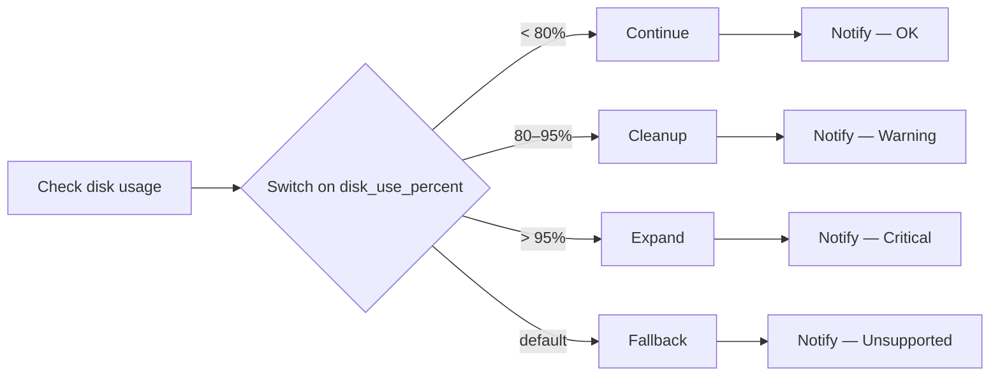

# Disk Utilization Demos

Proportional disk remediation with **automation orchestrator** — check usage, respond at the right level, tell the team what happened.

## The use case

Servers run out of disk space in different ways and at different urgency. A filesystem at 72% is fine. At 85% you want automated housekeeping before it becomes an outage. At 97% you need capacity added now. Paging on every check or doing nothing until critical both miss the mark.

The **Disk Utilization & Remediation Workflow** closes that gap:

1. **Check** — read usage on a mount (`/` by default) and publish `disk_use_percent` as an artifact
2. **Decide** — route by how full the disk is, not whether Ansible turned green
3. **Remediate** — take the action that matches the situation (nothing, cleanup, EBS expand, or escalate)
4. **Notify** — post a tier-specific summary to Mattermost so operators know what ran and why

On a RHEL EC2 host, the critical path can expand the root EBS volume in AWS, grow the partition, and extend the XFS filesystem — then report volume before/after in chat.

**One-liner:** *Don't page someone at 72%. Don't just log at 97%.*

## Why automation orchestrator switches fit here

Classic AAP workflows branch on success or failure. Disk utilization isn't pass/fail — it's a spectrum. An automation orchestrator **switch** routes on `disk_use_percent` in one step: four ports, four proportionate responses, four small playbooks instead of one playbook full of `when:` conditions.

## Demos

| Level | Demo | What It Shows |
|---|---|---|
| [101](101-disk-threshold-routing/) | Disk Utilization & Remediation Workflow | Check → switch on use % → continue / cleanup / expand / fallback → per-branch Mattermost notify |

## Architecture (101)

Each branch runs a focused remediate job template, publishes results via `set_stats`, and notifies the team with a message tailored to that tier.
