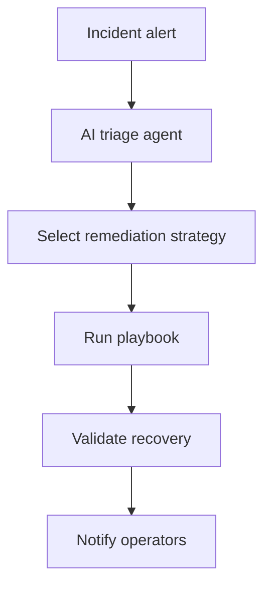
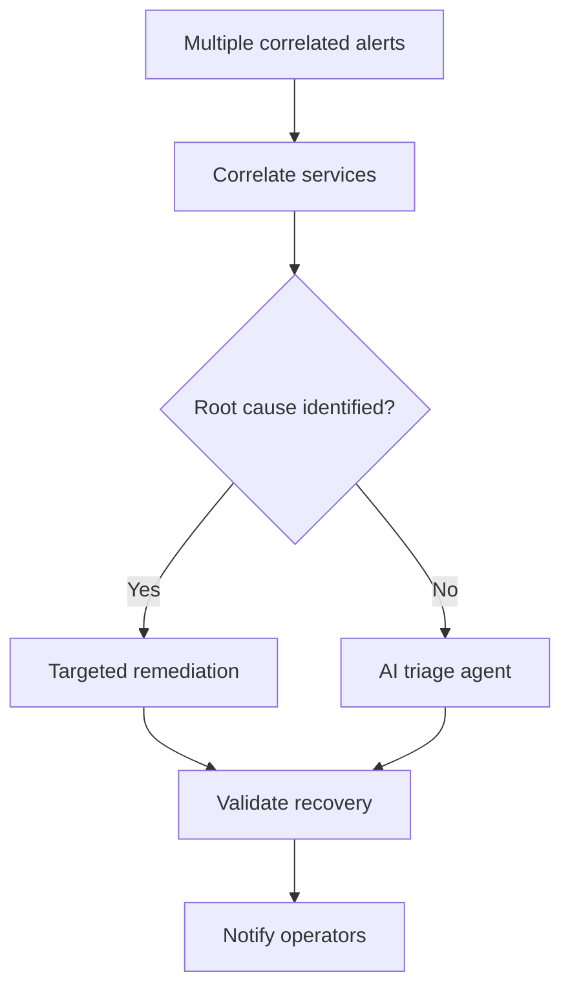

# Incident Remediation Demos

Coming soon. Demos showing automation orchestrator handling multi-step IT incidents beyond single-service switch routing.

> **Note:** Single-service check-and-remediate (start, restart, install) lives under [service-health/](../service-health/) — the hero switch demo from the deck.

## Demos

| Level | Demo | Status | What it shows |
|---|---|---|---|
| 201 | AI Incident Triage | Coming soon | AI agent selects remediation strategy from alert context |
| 301 | Multi-Service Correlation | Coming soon | Correlate alerts across services before remediation |

## Workflow (201 — coming soon)

## Workflow (301 — coming soon)

