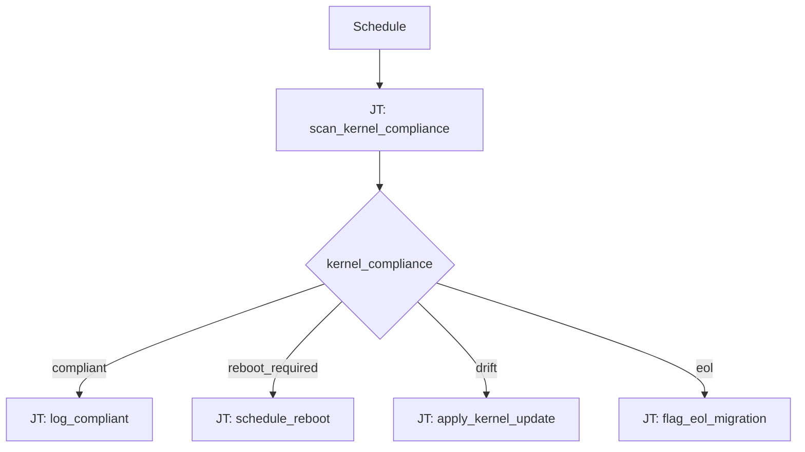

# Kernel Compliance 101: Kernel Compliance Routing

**Status: Coming soon** — scaffold only.

## What this demo shows

Switch on kernel compliance state from a scan playbook:

| `kernel_compliance` | Action |
|---|---|
| `compliant` | Log OK |
| `reboot_required` | Schedule maintenance reboot |
| `drift` | Apply kernel update playbook |
| `eol` | Flag for migration planning |

## Workflow



## Planned artifacts

```
101-kernel-compliance-routing/
  ao/
  aap/playbooks/
  README.md
```
