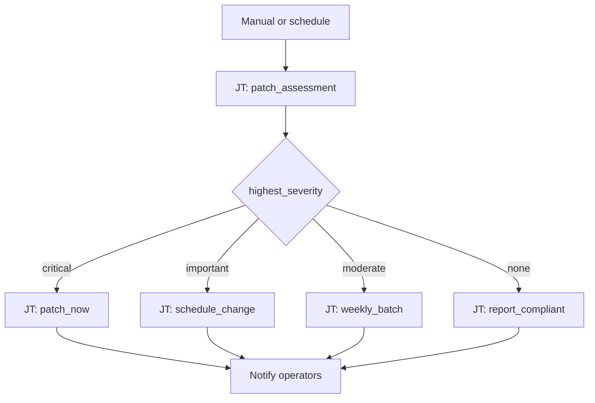

# Patch Management 101: Patch Severity Routing

**Status: Coming soon** — scaffold only. Playbooks and AO workflow JSON not built yet.

## What this demo shows

Run a patch assessment playbook that publishes `highest_severity` from `dnf updateinfo` or an Insights scan. Switch on the value and route to the response that matches your change policy.

| `highest_severity` | Action |
|---|---|
| `critical` | Patch now + open maintenance window |
| `important` | Schedule change window |
| `moderate` | Add to weekly batch |
| `none` | Report compliant, exit |

## Workflow



## Playbooks

🚧 **Under development** — playbook list and source links will be added when this demo is built.

## Planned artifacts

```
101-patch-severity-routing/
  ao/
  aap/playbooks/
  README.md
```
