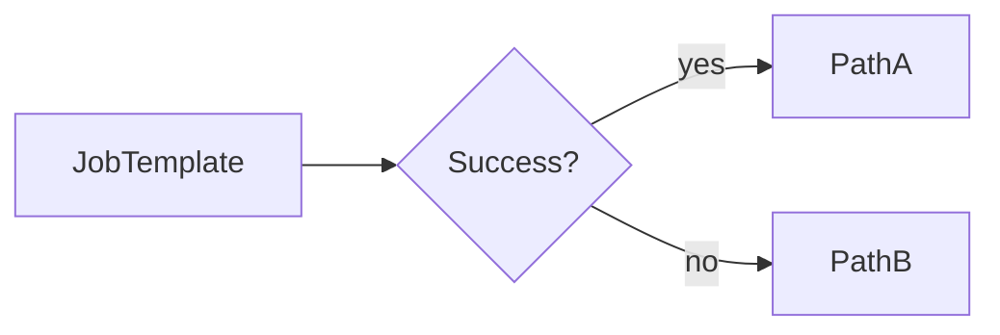
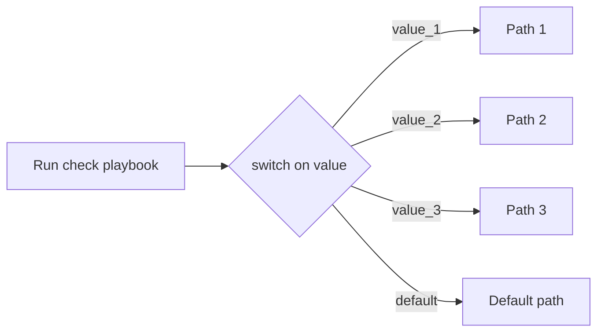
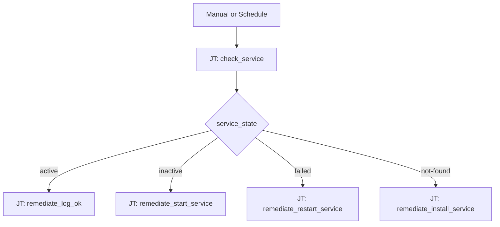
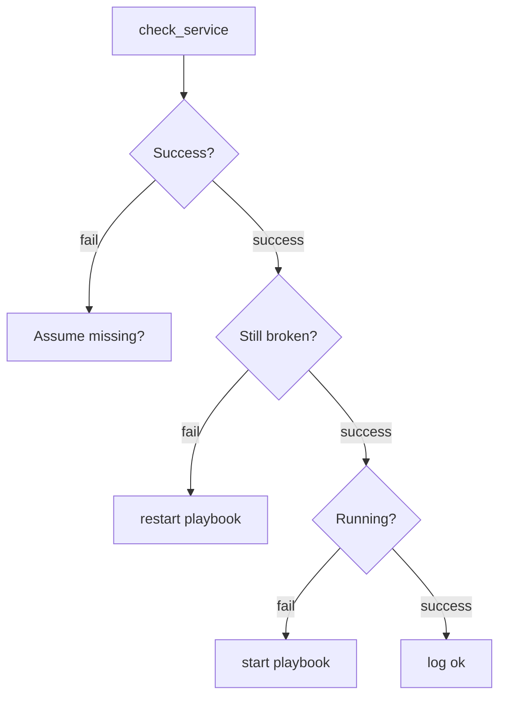
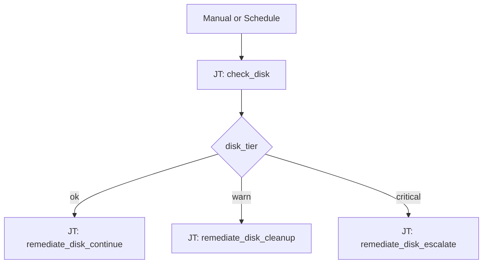

# Switch Statement Use Cases — Slide Talking Points

Talking points for a 15-minute deck on Automation Orchestrator switch statements vs traditional Controller workflow branching.

---

## Slide 1: Binary vs Switch

**Title:** Traditional workflows ask "did it pass?" — Orchestrator asks "what happened?"

**Talking points:**

- Controller workflows branch on **success**, **failure**, or **always** — at most two meaningful paths per decision node.
- Getting four different outcomes means nesting decision nodes or stuffing `when:` logic into a single "recovery" playbook.
- A **switch** routes on a **value** (`service_state`, `disk_tier`, `request_type`) in one step.
- Sysadmin mental model: *"What kind of situation is this?"* not *"Did the job turn green?"*

**Diagram (binary):**



**Diagram (switch):**



**Speaker note:** Binary is fine for "deploy then test." It breaks down when one check produces multiple *kinds* of truth.

---

## Slide 2: Hero Demo — Service Health

**Title:** Same check, four different fixes — one switch.

**Story:** One host, one service (`httpd`). Run a check playbook. Route remediation by `service_state`.

| `service_state` | Path | Job template playbook |
|-----------------|------|------------------------|
| `active` | Green — done | `remediate_log_ok.yml` |
| `inactive` | Yellow — start it | `remediate_start_service.yml` |
| `failed` | Orange — logs + restart | `remediate_restart_service.yml` |
| `not-found` | Red — install | `remediate_install_service.yml` |

**Diagram:**



**Contrast (same 4 outcomes, Controller style):**



**Speaker note:** The nested tree is harder to read, harder to maintain, and still guesses at failure meaning.

**Live demo:** Import [workflows/service-health-switch-demo.json](../workflows/service-health-switch-demo.json). Stop `httpd`, launch workflow → `inactive` path. `dnf remove httpd`, launch again → `not-found` path.

---

## Slide 3: Disk Utilization (easy favorite)

**Title:** Three business decisions from one observation.

**Story:** Everyone has dealt with a full disk. Run one check. Route by how full the filesystem is — not whether the job passed or failed.

**Switch on:** `disk_tier` (from `df` use % on `/` or `/var`)

| `disk_tier` | Use % | Path | Action |
|-------------|-------|------|--------|
| `ok` | &lt; 80% | Green | Continue — no action |
| `warn` | 80–95% | Yellow | Cleanup logs and package cache |
| `critical` | &gt; 95% | Red | Extend volume or page admin |

**Diagram:**



**ASCII (slide-friendly):**

```
Check disk usage
       |
  Switch on %
       |
-------------------------
<80%     80-95%     >95%
  |         |          |
Continue   Cleanup   Extend volume
           logs      or page admin
```

**One-liner:** *"Don't page someone at 72%. Don't just log at 97%."*

**Why this works:** One observation (`df`), three distinct operational responses. Binary workflow branching can't express "warn but don't fail" without nesting nodes or hiding logic inside the playbook.

**Live demo:** Import [workflows/disk-utilization-switch-demo.json](../workflows/disk-utilization-switch-demo.json). Fill `/var` on a test host to cross 80% or 95% and watch the switch route to cleanup or escalate.

---

## Slide 4: Rapid Fire — Patch Severity & Certificate Expiry

**Patch severity** — switch on `highest_severity` after `dnf updateinfo` or Insights scan:

| Value | Action |
|-------|--------|
| `critical` | Patch now + maintenance window |
| `important` | Schedule change window |
| `moderate` | Weekly batch |
| `none` | Report compliant, exit |

**Certificate expiry** — switch on `cert_status` from days remaining:

| Value | Action |
|-------|--------|
| `healthy` (&gt; 60 days) | Skip |
| `plan` (30–60 days) | Open change request |
| `renew` (7–30 days) | Run renewal playbook |
| `emergency` (&lt; 7 days) | Renew + alert + verify chain |

**One-liners:**

- *"One scan job. Four remediation strategies."*
- *"Expiry isn't pass/fail — it's a countdown."*

---

## Slide 5: Closer — User Lifecycle

**Title:** One form. Four completely different runbooks.

**Switch on:** `request_type` from survey, webhook, or ticket integration.

| Value | Action |
|-------|--------|
| `new_hire` | Create user, SSH key, sudo, groups |
| `contractor` | Create user, expiry date, limited sudo |
| `role_change` | Update groups/sudo only |
| `termination` | Lock account, archive home, revoke keys |

**Speaker note:** Switch isn't only for technical metrics — human input maps cleanly to string values.

**Close line:** *"Controller workflows chain jobs by outcome. Orchestrator routes by meaning."*

---

## Appendix: Playbook pattern

The check playbook publishes one fact for the switch via `set_stats`:

```yaml
# Service health example
- name: Publish service_state for workflow switch
  ansible.builtin.set_stats:
    data:
      service_state: "{{ check_service_state.stdout | trim }}"
    aggregate: false

# Disk utilization example
- name: Publish disk_tier for workflow switch
  ansible.builtin.set_stats:
    data:
      disk_tier: "{{ disk_tier }}"
      disk_use_percent: "{{ disk_use_percent }}"
    aggregate: false
```

Orchestrator switch expressions: `{{ service_state }}` or `{{ disk_tier }}` (from the check job artifacts).

Downstream job templates stay small and single-purpose — routing lives in the orchestration layer.

---

## Appendix: Additional use cases (backup slides)

- **Backup result:** `success` / `partial` / `failed` / `skipped` — partial is neither pass nor fail
- **RHEL subscription:** `registered` / `expiring` / `expired` / `unregistered`
- **Kernel compliance:** `compliant` / `reboot_required` / `drift` / `eol`

**Avoid in early demos:** multi-distro patch matrices, AI routing, more than five branches without a `default`.
