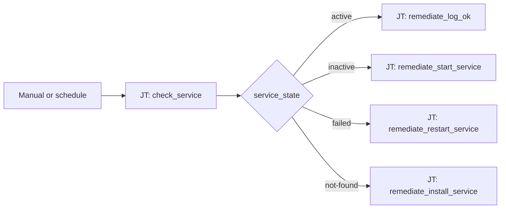

# Service Health 101: Service State Routing

**Status: Coming soon** — scaffold only. Playbooks and AO workflow JSON not built yet.

## What this demo shows

One host, one service (`httpd`). Run a check playbook that publishes `service_state`. Route remediation in a single switch — no nested Controller decision trees.

| `service_state` | Path | Planned action |
|---|---|---|
| `active` | Green — done | Log OK, no changes |
| `inactive` | Yellow — start it | Start the service |
| `failed` | Orange — recover | Inspect logs and restart |
| `not-found` | Red — install | Install the package and enable the unit |

## Workflow



## Playbooks

🚧 **Under development** — playbook list and source links will be added when this demo is built.

## Why not binary branching?

The same four outcomes in a Controller-style workflow require nested success/failure nodes that still guess at failure meaning. The switch reads one artifact and routes by **meaning**.

## Planned artifacts

When built, this level will include:

```
101-service-state-routing/
  ao/               # automation orchestrator workflow JSON
  aap/playbooks/    # check_service + four remediate playbooks
  README.md         # this file
```

## Demo ideas

- Stop `httpd` → workflow routes to **inactive** → start path
- `dnf remove httpd` → workflow routes to **not-found** → install path
