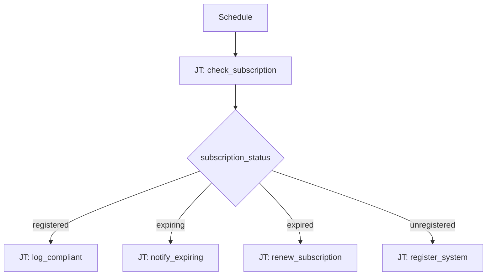

# Subscription Management 101: RHEL Subscription Routing

**Status: Coming soon** — scaffold only.

## What this demo shows

Switch on RHEL subscription state after a compliance check:

| `subscription_status` | Action |
|---|---|
| `registered` | Log compliant |
| `expiring` | Notify + schedule renewal |
| `expired` | Register or attach subscription |
| `unregistered` | Register with activation key |

## Workflow



## Playbooks

🚧 **Under development** — playbook list and source links will be added when this demo is built.

## Planned artifacts

```
101-rhel-subscription-routing/
  ao/
  aap/playbooks/
  README.md
```
