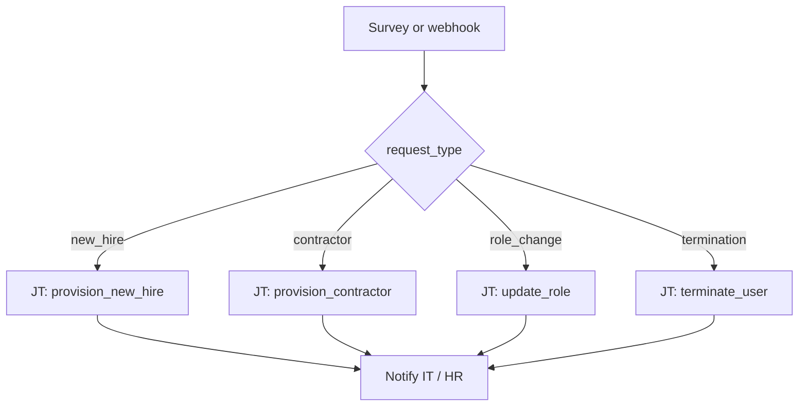

# User Lifecycle 101: Request Type Routing

**Status: Coming soon** — scaffold only. Playbooks and AO workflow JSON not built yet.

## What this demo shows

Switch on `request_type` from an AO survey, webhook, or ticket integration. Each value triggers a purpose-built automation path.

| `request_type` | Action |
|---|---|
| `new_hire` | Create user, SSH key, sudo, groups |
| `contractor` | Create user, expiry date, limited sudo |
| `role_change` | Update groups and sudo only |
| `termination` | Lock account, archive home, revoke keys |

Switch routing is not only for technical metrics — human input maps cleanly to string values.

## Workflow



## Planned artifacts

```
101-request-type-routing/
  ao/
  aap/playbooks/
  README.md
```
